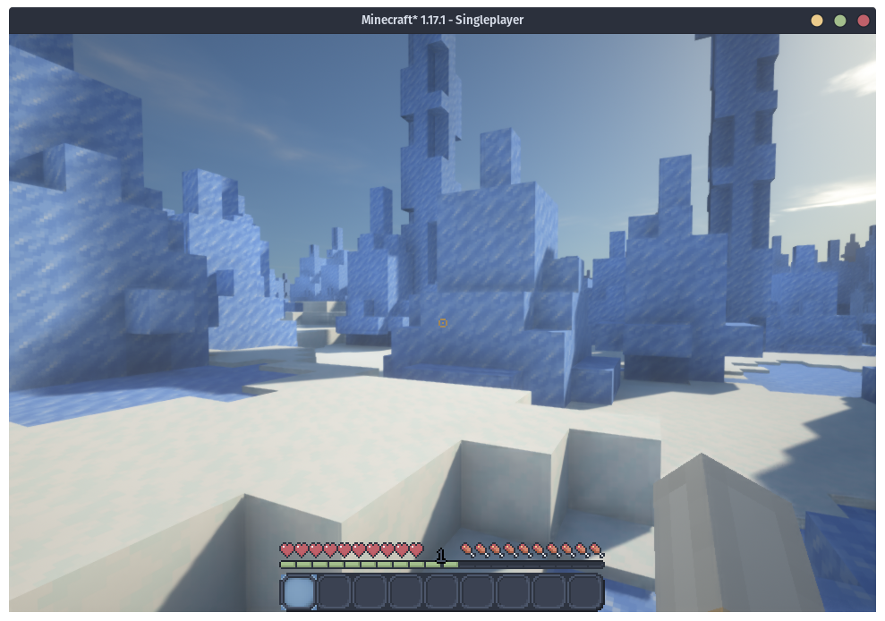
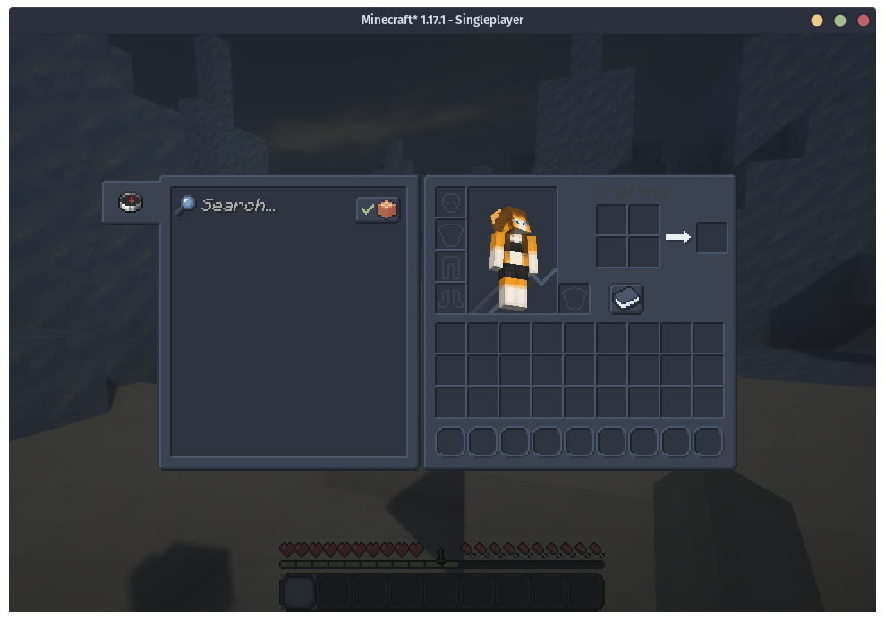

# Minecraft Nord Resource Pack

This pack is an attempt to create a nice and cohesive implementation of the Nord color palette for Minecraft. Only user interface elements will be textured.

*This is a work in progress. Many textures have not been completed yet.*

## Build instructions

This repo comes with a handy Makefile to automate the install.

* `make` or `make all` - Zips the pack
* `make clean` - Removes the pack from the directory
* `make install` - Zips the pack, and puts it in your resource packs folder. You will still have to manually select it in options.

Alternatively, you can just zip the files and install manually.

## Preview

*(The shaders displayed in this screenshot are not part of the pack)*